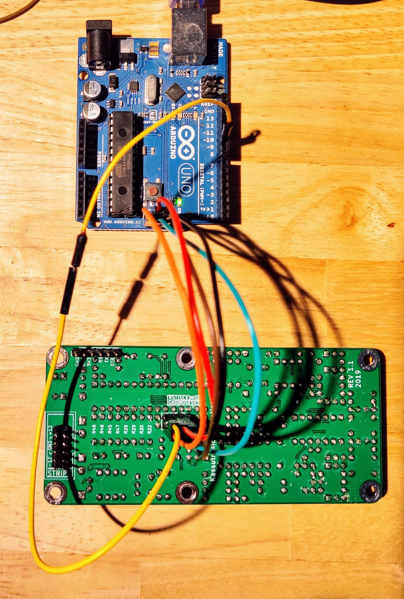

# Programming or updating the Quantizer firmware using an Arduino Uno as ISP programmer

If you have a spare Arduino Uno, it can be used as an In-circuit Serial Programmer to program or upload the firmware to the quantizer. Follow these instructions carefully.

## Requirements
1. Quantizer main PCB with all parts soldered, and U3 (voltage regulator) socketed
2. Arduino Uno
3. 6 jumper wires (5 female-female, 1 male-female)
4. A computer with up-to-date Arduino IDE installed
5. Download the lastest Quantizer source code

## Instructions
1. Remove Eurorack power from the Quantizer
2. Remove the Main board from the Front Panel board and assembly
3. *Remove U3* from it's socket to avoid reverse-powering the voltage regulator
4. Connect the Arduino via USB. In the Arduino IDE, go to File -> Examples -> ArduinoISP -> ArduinoISP. Upload the sketch
5. Locate the 6-pin ICSP header on both the Arduino (labeled _ICSP_) and on the Quantizer (_J1_)
6. Connect the jumper wires as follows:

| Arduino PIN | Quantizer PIN |
|-------------|---------------|
| D10         | RST           |
| SCK         | SCK           |
| MISO        | MISO          |
| GND         | GND           |
| MOSI        | MOSI          |
| 5V          | 5V3           |

So, the quantizer RST pin connects to digital pin 10 on the Arduino, and all other pins on the ISCP header connect one-to-one between the two boards. In the picture below the boards are rotated such that the ISCP headers have pin 1 (MISO) in the top-right corner on both boards. On the Quantizer there is a silkscreen label with the pinout.

7. In the Arduino IDE, open `KassutronicsQuantizer.ino`
8. Select Tools -> Programmer -> __Arduino as ISP__
9. Click Sketch -> Upload using Programmer

It will take some time to compile and then upload, and if all goes well the status bar will show _Done uploading_ in the end.

Now your quantizer is programmed!
